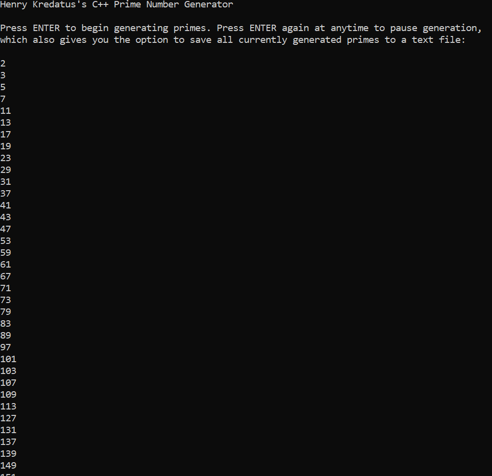
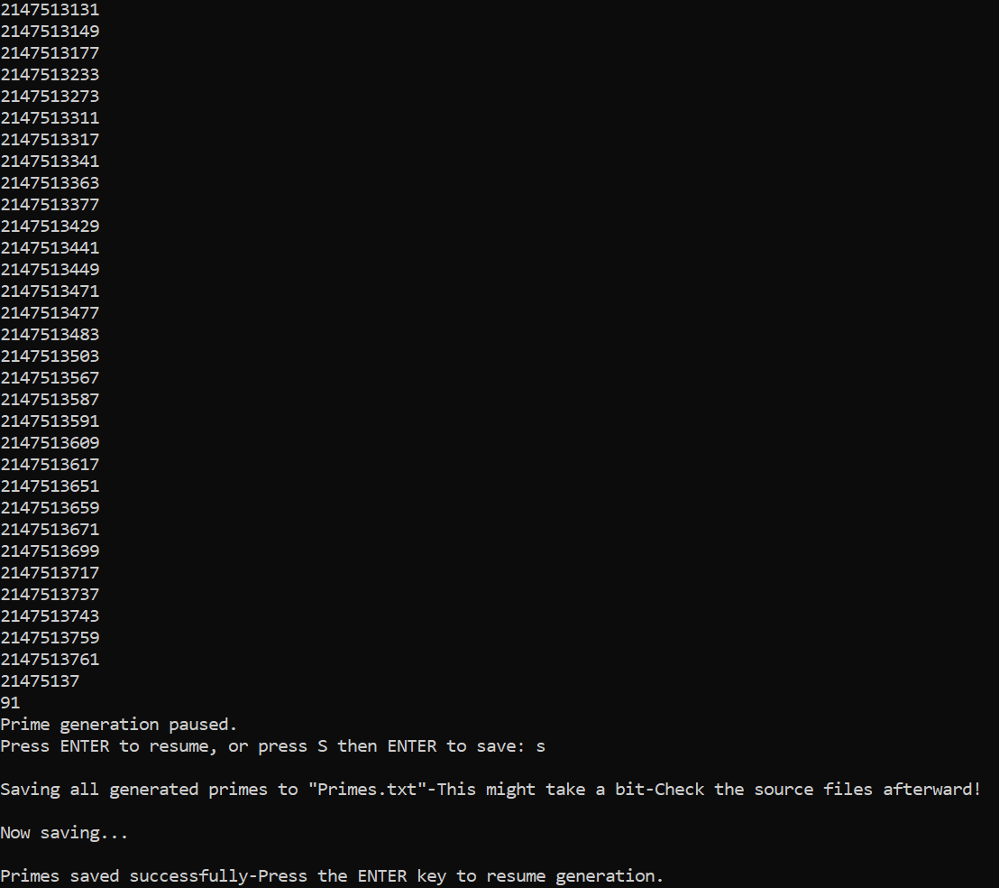

# Prime Number Generator

This is a tool to automatically "generate," display, and store prime numbers.

A prime is any number with EXACTLY two factors, one and itself, and this tool checks every integer to see if it meets that criterion (displaying and storing it in a vector) if so. It accomplishes this by running through every integer between two and the potential prime's (approximate) square root to see if any are indeed factors using the modulo operator, and if none are, then the number is indeed prime.

The program makes use of two loops: one with ints to maximize speed for the first several hours, and a second with long longs for all numbers at or above the int limit to allow it to go beyond that (albeit with slightly reduced speed). The program also allows the user to pause and unpause by hitting enter, and also save all currently generated primes to an outfile while paused.

## CONTROLS

ENTER (At Start) - Begin Generating
ENTER (While Running) - Pause Generator
ENTER (While Paused) - Resume Generator
S+ENTER - Save All Generated Primes to "Primes.txt" in the Source Files (ONLY WHILE PAUSED, Takes Longer the Larger the List)

## Running

